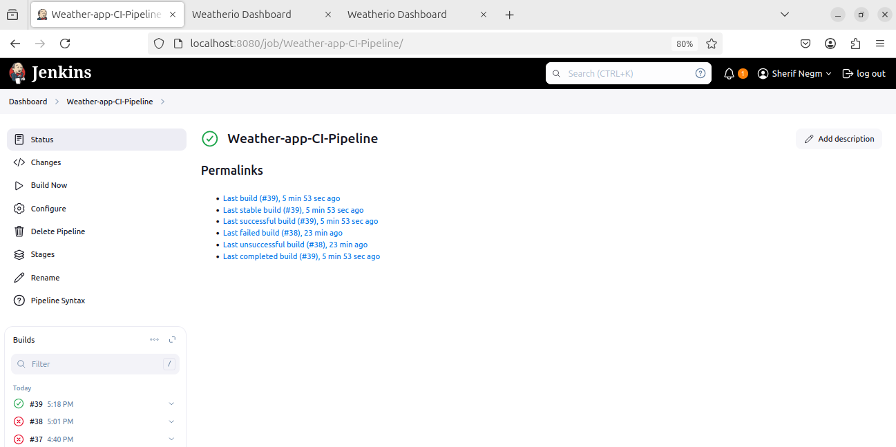
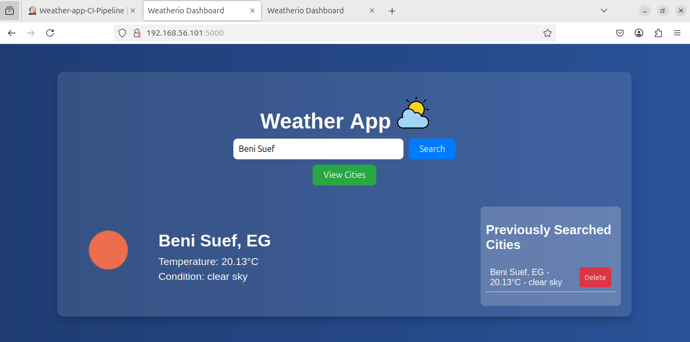
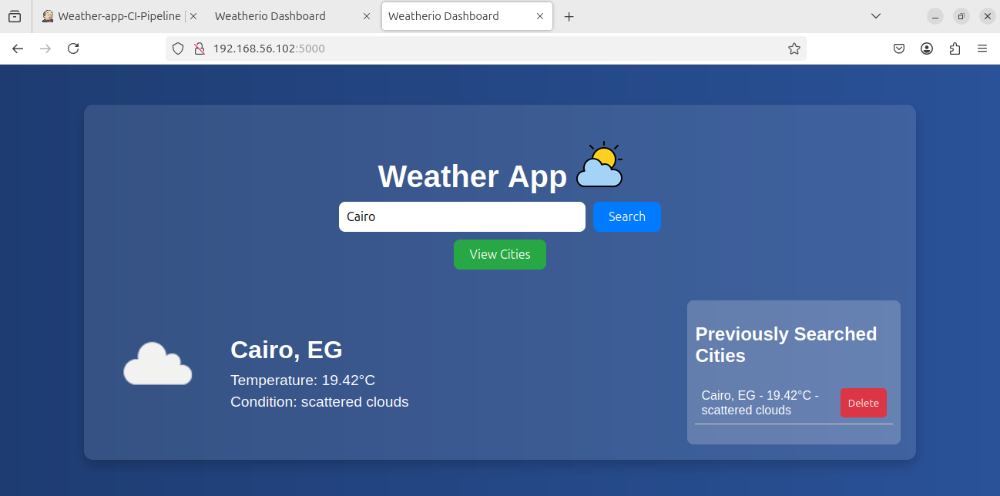
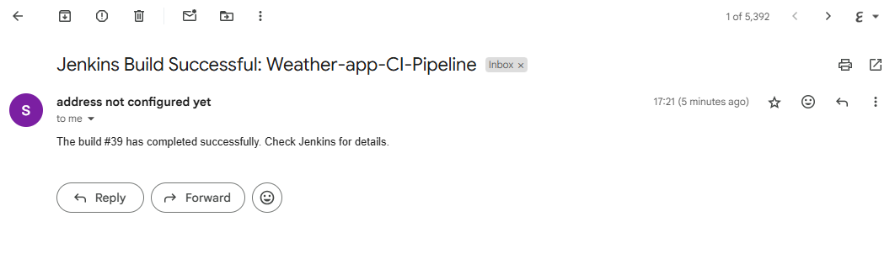

# 🌦️ Weather App – CI/CD Deployment with Jenkins, Ansible & Docker  

## 📌 Project Overview  
This project automates the deployment of a simple **Weather App** using **Jenkins, Ansible, Docker, and Vagrant**. The pipeline builds, deploys, and runs the application on two VMs using Ansible playbooks.  

---

## � Technologies Used  

- **Jenkins**: CI/CD automation  
- **Ansible**: Configuration management & deployment  
- **Docker**: Containerization  
- **Vagrant**: VM provisioning  
- **GitHub**: Version control  

---

## 📜 CI/CD Pipeline Workflow  

1. **Trigger Pipeline** – Jenkins fetches the latest code from GitHub  
2. **Build Stage** – Creates a Docker image  
3. **Push Image** – Uploads the image to Docker Hub  
4. **Deploy Stage** – Ansible provisions the VMs and runs the container  

📸 **Pipeline Success Screenshot**  
  

---

## 🛠️ Prerequisites  

1. Install **Jenkins**, **Docker**, **Ansible**, and **Vagrant**  
2. Clone the repository:  
   ```sh
   git clone https://github.com/sherifnajmeldein/weather-app.git
   cd weather-app
🔧 Setup & Deployment
1️⃣ Configure Vagrant Machines
Run the following to provision the VMs:

sh
Copy
vagrant up
2️⃣ Jenkins Pipeline Setup
In Jenkins, create a new pipeline job.

Use GitHub as the SCM and link the repository.

Add the Jenkinsfile to execute the pipeline.

3️⃣ Run the Ansible Playbook
sh
Copy
ansible-playbook -i ansible/inventory ansible/deploy.yaml
4️⃣ Access the Web App
Find the IPs of the two VMs and access them in your browser:

cpp
Copy
http://<vm1-ip>:5000  
http://<vm2-ip>:5000  
📸 Website Running on Two VMs
 *Figure 1: Weather App running on VM 1.* 
  *Figure 2: Weather App running on VM 2.*


✉️ Email Notifications (Optional)
The pipeline is configured to send an email on failure.

📸 Email Notification Example
Email Notification
  
*Figure 3: Example of an email notification sent on pipeline failure.*  
🤝 Contributing
Feel free to fork this repository and submit Pull Requests!

📌 Maintainer
👤 Sherif Negm
🔗 [LinkedIn](https://www.linkedin.com/in/sherif-negm-300b451ba/) | ✉️ negmsherif8@gmail.com
